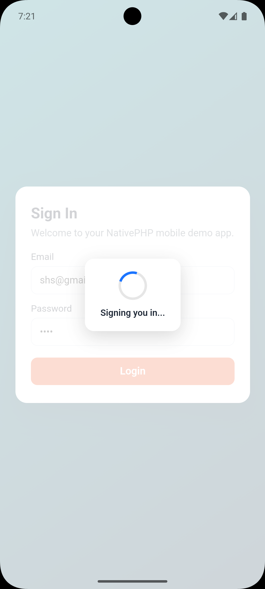

# Mobikul Loader for NativePHP Mobile

Show and hide loader state in NativePHP Mobile apps, with optional Blade and web view support.

To find out more, visit: https://mobikul.com/

## What this plugin does

`mobikul_loader` provides two NativePHP bridge methods:

- `MobikulLoader.Show`
- `MobikulLoader.Hide`

These methods return loader state that your app can use while processing actions such as login, sync, or API requests.

The package also includes an optional HTML, CSS, and JavaScript helper for Blade-based screens or hybrid web views where you want a ready-made overlay spinner.

## Requirements

- PHP `8.2` or higher
- Laravel support package compatibility: `^10.0`, `^11.0`, or `^12.0`
- `nativephp/mobile` `^3.0`
- A NativePHP Mobile application

## Installation

Install the package:

```bash
composer require mobikul/mobikul_loader
```

Register the plugin with NativePHP:

```bash
php artisan native:plugin:register mobikul/mobikul_loader
```

If this is your first time installing the plugin, or if you later change native bridge files, rebuild the native layer:

```bash
php artisan native:install --force
```

If you install from the NativePHP marketplace, configure the NativePHP Composer repository and credentials first:

```bash
composer config repositories.nativephp-plugins composer https://plugins.nativephp.com
composer config http-basic.plugins.nativephp.com <your-email> <your-license-key>
composer require mobikul/mobikul_loader
php artisan native:plugin:register mobikul/mobikul_loader
```

## Optional Asset Publishing

If you want to use the included Blade or web view loader UI, publish the package assets:

```bash
php artisan vendor:publish --tag=mobikul-loader-assets
```

This publishes the loader files to:

```text
public/vendor/mobikul_loader/
```

## Quick Start

Example login flow using the bridge methods from a NativePHP web view:

```js
async function signIn() {
  await fetch('/_native/api/call', {
    method: 'POST',
    headers: { 'Content-Type': 'application/json' },
    body: JSON.stringify({
      method: 'MobikulLoader.Show',
      params: { message: 'Signing you in...' }
    })
  });

  try {
    await fakeLoginRequest();
  } finally {
    await fetch('/_native/api/call', {
      method: 'POST',
      headers: { 'Content-Type': 'application/json' },
      body: JSON.stringify({
        method: 'MobikulLoader.Hide',
        params: {}
      })
    });
  }
}
```

## JavaScript Usage

You can call the bridge endpoint directly:

```js
await fetch('/_native/api/call', {
  method: 'POST',
  headers: { 'Content-Type': 'application/json' },
  body: JSON.stringify({
    method: 'MobikulLoader.Show',
    params: { message: 'Loading...' }
  })
});
```

Or use the included helper module from [mobikulLoader.js](/Users/aman/Documents/Native/plugins/mobikul_loader/resources/js/mobikulLoader.js):

```js
import { show, hide } from './vendor/mobikul_loader/js/mobikulLoader.js';

await show({ message: 'Loading...' });
await hide();
```

The helper is intended for bundled frontend code in your app. The import path above is an example and may need to be adjusted to match your app's frontend build setup. If you are not using a bundler, call the bridge endpoint directly.

## Bridge Methods

### `MobikulLoader.Show`

Marks the loader as visible and returns the resolved loader state.

Parameters:

- `message` optional string shown in the response payload

Returns:

```json
{
  "visible": true,
  "message": "Loading..."
}
```

### `MobikulLoader.Hide`

Marks the loader as hidden and returns the resolved loader state.

Returns:

```json
{
  "visible": false
}
```

## Blade and Web View Helper

If your NativePHP app renders Blade or hybrid web views, you can use the included helper to render a loader overlay after publishing assets:

```php
<?php

use MobikulLoader\HtmlLoader;

$loader = new HtmlLoader('mobikul-native-loader', 'Please wait...');
?>

<link rel="stylesheet" href="/vendor/mobikul_loader/css/loader.css">

<?= $loader->render(); ?>

<script src="/vendor/mobikul_loader/js/loader.js"></script>
<script>
  window.MobikulNativeLoader.show('mobikul-native-loader');

  setTimeout(() => {
    window.MobikulNativeLoader.hide('mobikul-native-loader');
  }, 1200);
</script>
```

## Important Behavior

This plugin currently provides loader state bridge responses and optional web-based loader UI helpers. The native bridge implementations return a success payload that your app can use to coordinate loading behavior on Android and iOS.

If your app needs a fully rendered platform-native overlay component, extend the native bridge implementations in:

- `resources/android/src/MobikulLoaderFunctions.kt`
- `resources/ios/Sources/MobikulLoaderFunctions.swift`

## Permissions

This plugin does not require any special permissions.

- Android permissions: none
- iOS Info.plist permissions: none

## Events

This plugin does not dispatch any custom NativePHP events in the current version.

## Validation

Run validation from your NativePHP app root:

```bash
php artisan native:plugin:validate
```

If you change native bridge code or the plugin manifest, rebuild the native layer:

```bash
php artisan native:install --force
php artisan native:run
```

## Versioning

This plugin follows semantic versioning.

- `MAJOR` for breaking API or manifest changes
- `MINOR` for backward-compatible features
- `PATCH` for fixes and documentation updates

## Preview

Loader UI example inside a NativePHP Mobile login screen:


